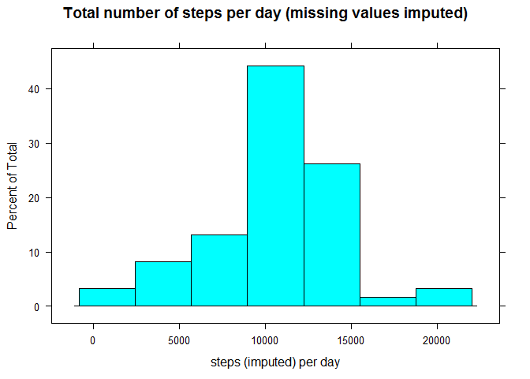

# Reproducible Research: Activity Monitoring
Peter Pesch  
February 10, 2017  


## Loading and preprocessing the data

This assignment makes use of data from a personal activity monitoring device.
This device collects data at 5 minute intervals through out the day.
The data consists of two months of data from an anonymous individual
collected during the months of October and November, 2012
and include the number of steps taken in 5 minute intervals each day.

We load the data.  
The interval is given as an integer designating the starttime.
We convert the starttime into a string:


```r
library(lattice)
library(knitr)
```

```
## Warning: package 'knitr' was built under R version 3.3.2
```

```r
activity <- read.csv(unz("activity.zip","activity.csv"), 
                     header=TRUE,
                     colClasses=c("integer","Date","integer"))

act.hour <- activity$interval %/% 100
act.min  <- activity$interval %%  100
activity$time <-sprintf("%02d:%02d",act.hour,act.min)               ## "hh:mm"
rm(act.hour, act.min)
activity[280:290,]
```

```
##     steps       date interval  time
## 280    NA 2012-10-01     2315 23:15
## 281    NA 2012-10-01     2320 23:20
## 282    NA 2012-10-01     2325 23:25
## 283    NA 2012-10-01     2330 23:30
## 284    NA 2012-10-01     2335 23:35
## 285    NA 2012-10-01     2340 23:40
## 286    NA 2012-10-01     2345 23:45
## 287    NA 2012-10-01     2350 23:50
## 288    NA 2012-10-01     2355 23:55
## 289     0 2012-10-02        0 00:00
## 290     0 2012-10-02        5 00:05
```

## What is mean total number of steps taken per day?

We calculate the number of steps taken per day (leaving out the NA values):


```r
steps.per.day <- tapply(activity$steps,activity$date,sum,na.rm=TRUE)
histogram(steps.per.day, main="Total number of steps per day")
```

<!-- -->

```r
mean_and_median <- data.frame(mean=mean(steps.per.day), median=median(steps.per.day))
kable(mean_and_median, caption="Total number of steps per day")
```


Table: Total number of steps per day

    mean   median
--------  -------
 9354.23    10395

```r
rm(mean_and_median)
```

## What is the average daily activity pattern?

To investigate the daily activity pattern, we create a data set containing the
average number of steps per interval (again leaving out the NA values).

For the time scale, we choose a number of suitable lables.


```r
steps.per.interval <- tapply(activity$steps,activity$time,mean,na.rm=TRUE)

df <- data.frame(interval=names(steps.per.interval),steps=steps.per.interval)
## Select labels for the x-as (time)
xlabels <- rep("",288) ## We choose 1 label per 4 hours (48 5-minute intervals)
xlabels[  1] <- as.character(names(steps.per.interval)[  1])    ## 00:00
xlabels[ 49] <- as.character(names(steps.per.interval)[ 49])    ## 04:00
xlabels[ 97] <- as.character(names(steps.per.interval)[ 97])    ## 08:00
xlabels[145] <- as.character(names(steps.per.interval)[145])    ## 12:00
xlabels[193] <- as.character(names(steps.per.interval)[193])    ## 16:00
xlabels[241] <- as.character(names(steps.per.interval)[241])    ## 20:00

xyplot(steps~interval, df,type="l", xlim=xlabels,
       xlab="time of day",
       ylab="average number of steps",
       main="Average number of steps per time interval")
```

<!-- -->


```r
optimal_interval <- 
    steps.per.interval[steps.per.interval==max(steps.per.interval)]
print(round(optimal_interval)[1])
```

```
## 08:35 
##   206
```

On average, most steps are taken during the 5-minute interval starting at 08:35.

## Imputing missing values


```r
act.missing <- is.na(activity$steps)
sum(act.missing)
```

```
## [1] 2304
```

Note that there are 2304 intervals where there are missing values.  
The presence of missing days may introduce bias into some calculations or summaries of the data.  
I will solve this by making a copy of the dataset, in which each  missing value
has been replaced by the average number of steps for that interval.


```r
activity.imputed <- data.frame(
    steps   = ifelse (act.missing,
                      steps.per.interval[activity$time],
                      activity$steps),
    date    = activity$date,
    time    = activity$time
)
steps.imputed.per.day <- tapply(activity.imputed$steps,activity.imputed$date,sum)

histogram(steps.imputed.per.day,
          xlab="steps (imputed) per day",
          main="Total number of steps per day (missing values imputed)")
```

<!-- -->

```r
mean_and_median <- data.frame(
    mean=c(mean(steps.per.day),mean(steps.imputed.per.day)),
    median=c(median(steps.per.day),median(steps.imputed.per.day)))
rownames(mean_and_median) <- c("original", "imputed")
kable(mean_and_median, caption="Total number of steps per day")
```


Table: Total number of steps per day

                mean     median
---------  ---------  ---------
original     9354.23   10395.00
imputed     10766.19   10766.19

```r
rm(mean_and_median)
```

We can see that the lower tail of the histogram contains more steps than in the original plot.  
Furthermore, both the mean and the median are greater than in the original dataset.  
It looks as if imputing missing data (following this strategy)
leads to a larger estimate of the total number of steps.

## Are there differences in activity patterns between weekdays and weekends?

To make a comparison between weekdays and weekends, I will introduce a new column "daytype".


```r
## I won't be using the weekday() function, as its return values are locale-dependant.
daytype <- function(date) {
    wd <- as.POSIXlt(date)$wday
    if (wd>=1 && wd<=5) return ("weekday")  ## monday-friday
    else                return ("weekend")  ## saturday or sunday
}
activity.imputed$daytype <- as.factor(sapply(activity.imputed$date, daytype))
```


```r
steps.dtiv <- with(activity.imputed,tapply(steps,paste(daytype,time),mean))
dtiv.variables <- (strsplit(names(steps.dtiv), " "))
dtiv.factors <- do.call(rbind, dtiv.variables)
steps.daytype.interval <- data.frame(
    steps    = steps.dtiv,
    daytype  = dtiv.factors[,1],
    interval = dtiv.factors[,2]
)

xyplot(steps~interval|daytype, steps.daytype.interval, type="l",
       xlab="time of day",
       ylab="avergae number of steps (missing values imputed)",
       xlim=xlabels, scales=list(alternating=FALSE),
       layout=c(1,2))
```

<!-- -->

We see quite some differences between the daily patterns, especially between 06:00 and 09:00.  
Furthermore, between 09:00 and 17:00 we see a lower number of steps during weekdays than in the weekend.  
And during weekdays, activity seems to decrease earlier than in the weekend.

Further analysis will be needed in order to decide
whether any of these effects is statistically signifficant.
